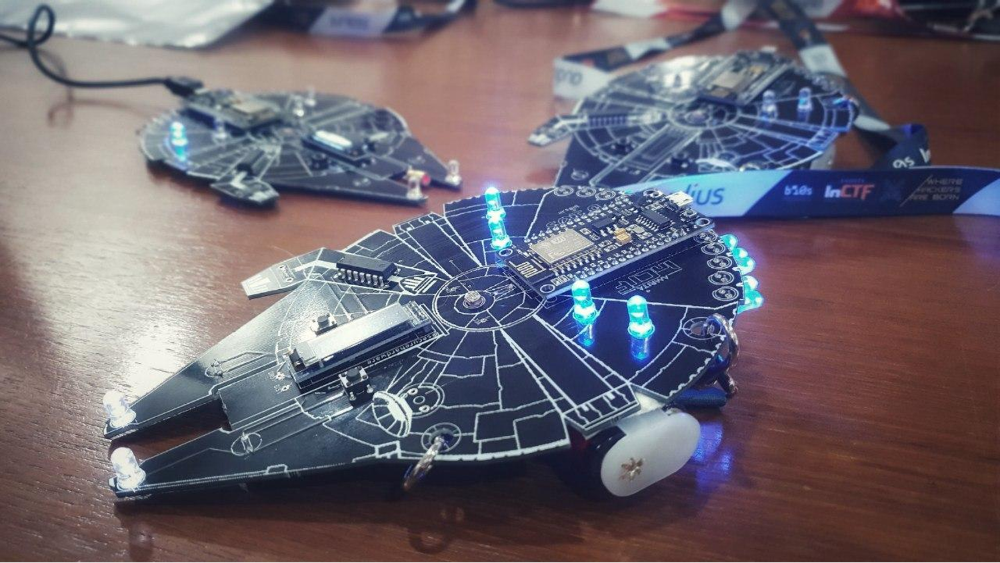

# Falcon-Badge



**Work in progress.**

**Check the OTA folder for updated beta features**

## Layout
```
├── bin
│   ├── falcon-fire.bin
│   ├── final-unlocked.bin
│   ├── game_of_life.bin
│   ├── initial.bin
│   └── serial-exploitation.bin
├── hw
│   ├── Assembly
│   ├── DrillFiles
│   ├── GerberFiles
│   ├── InCTF_Badge.brd
│   └── InCTF_Badge.sch
├── LICENSE
├── README.md
└── src
    ├── falcon-fire
    ├── Final
    ├── Game-Of-Life
    ├── initial
    │   ├── data
    └── serial-exploitation
```
### Software Pre-requisities
Software to install:
* For Windows:
    * [USB-UART Driver](https://www.silabs.com/products/development-tools/software/usb-to-uart-bridge-vcp-drivers)
* On Linux/Windows:
    * pyserial -> ```pip install pyserial```
    * esptool -> ```pip install esptool```
        * For more info visit [esptool](https://github.com/espressif/esptool).
    * miniterm.py (Installed with pyserial)

### Binaries

* falcon-fire.bin
    * A version of the 80s *Asteroid* Game.
* final-unlocked.bin
    * Firmware with unlocked LEDs and defence against laser attacks.
* game_of_life.bin
    * A version of *Conway's Game of Life* on Falcon.
* initial.bin
    * The basic firmware everyone's badge was loaded with.
* serial-exploitation.bin
    * Firmware that was designed to teach you serial exploitation.


### How to flash the firmware?

Make sure you've installed the correct drivers and the ```esptool.py```
Clone the repository and open a terminal in the same directory.
Run the following command with the desired file in the same terminal.
```
esptool.py write_flash 0x00000 initial.bin
```
### Source Code
The code is written with the help of [Arduino](https://github.com/esp8266/Arduino) SDK, considering it to be beginner-friendly platform. You can run [MicroPython](https://docs.micropython.org/en/latest/esp8266/tutorial/intro.html) on the same board as well.
#### The structure
The badge has the personal data of the users stored in the SPIFFS system. Hence we use the 4MB flash memory in NodeMCU with 1MB specified for filesystem.
If you're interested in learning more about the [Filesystem](https://arduino-esp8266.readthedocs.io/en/latest/filesystem.html) used in ESP8266 Arduino. 
This filesystem consists of the following files:
```
data/
├── chall.png -> The forensics challenge desgined by @_f41c0n
├── flag -> For the game 
├── id -> Cadet/Padawan/Rebel ID
├── ip -> Static IP Assigned to each badge
├── name -> Username
├── pass -> 5 char of username and 5 char of the phone number

```
#### Some of the used libraries include
* [ThingPulse SSD1306](https://github.com/ThingPulse/esp8266-oled-ssd1306)
* [Adafruit GFX](https://github.com/adafruit/Adafruit-GFX-Library)
* [Adafruit SSD1306](https://github.com/adafruit/Adafruit_SSD1306)
* [u8g2](https://github.com/olikraus/u8g2)
* Already included in the base installation
    * Wire
    * FS
#### How to compile? 
* If you have successfully installed Arduino IDE , you can just clone the code to get started.


You might face an issue of creating a new folder, just press "OK" and continue.
* If you like the makefile approach then I suggest you look at [makeEspArduino](https://github.com/plerup/makeEspArduino) project.
    * To build 
        ```make -f makeEspArduino.mk all FLASH_DEF=4M1M```
    * For flashing the code 
        ```make -f makeEspArduino.mk flash FLASH_DEF=4M1M```
    * For flashing the filesystem 
        ```make -f makeEspArduino.mk flash_fs FLASH_DEF=4M1M```
        
### Write-Ups 
<h3>You sure?</h3><details>

## Web Challenge
`?id=100` gives the correct flag

## Image Challenge
There is a base64 text appended to the image. Extracting and decoding it will give a table of 8 columns representing the 8 bits of each character.
Extract the binary data and decode it to get the flag.

## Serial Exploitation
The challenge starts with a login screen and on choosing the login option requires you to enter a randomly generated OTP. On analysis we can see that the LDR which is connected to the analog pin of the NodeMCU is used as the random seed for generating pseudo-random values. 

If we short the analog pin with the VCC the random seed value will remain constant and so the pattern of generated OTP will remain constant. So by using a sample code to generate the OTP pattern or by brute-force you can login to the system.

Once you login, you will get an option to read data from the board. You only have permission to read a maximum of 50 characters. But the array from which you are reading data is a byte array of size 260. The input given is to a signed 8 bit variable and the program first checks if the value is greater less than 50. After the initial condition is passed the value is moved to an unsigned 8 bit variable and then that many number of characters from the array is printed. So if we enter a negative number like ‘-1’ it will bypass the initial check and when the value is moved to the unsigned variable -1 becomes 255 and we can read 255 characters from the array. The flag is stored from the 188th index so the output we get by giving -1 as the input will contain the flag!

FLAG : falcon{y0u_3xtr4ct3d_th3_s3ctr3t_d4t4}
</details>

Read More:https://blog.bi0s.in/2020/01/21/Hardware/millenium_falcon/


### Credits

GameOfLife based on: [DrMikeG](https://raw.githubusercontent.com/DrMikeG/Conway/master/GameOfLife/GameOfLife.ino)

Falcon-Fire based on: [pauls-3d-things](https://github.com/pauls-3d-things/arduino-space-hopper)
